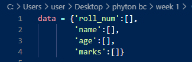
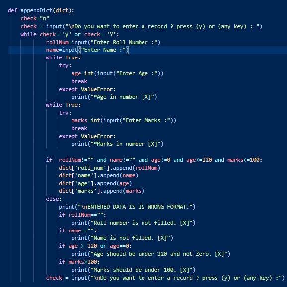

# Phyton BC Week-01 Assignment

## Question-02

# Code Screenshots and Explanation:
* ** PRINTING OF DICTIONARY AND CALCULATION OF MARKS IS NOT DONE :(
#
*  A list of dictionaries. With no values.

#
*  Below appendDict() is used to enter data in dictionary. It will continue on user choice(yes(y\Y) or no(n\N)). If yes(y\Y), than data is asked to be entered in different variables. This data is checked if it is empty or not, and for age and marks the user entered data must be an integer. 
* Marks are set out of 100 and Age is less than 120.
* If any of the above condition is not satisfied than data will not go in dictionary. Fucntion will asked for user choice to continue. and data is again fethced from user and checked. 
 

#